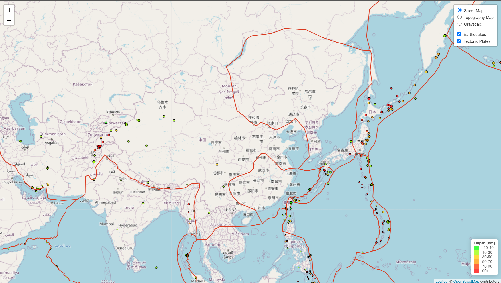

# Visualizing Data with Leaflet
Earthquake data is continuously measured and traced by the United States Geological Survey (USGS). In addition to the earthquake's location and time, the USGS note other features such as its depth and magnitude. [index.html](index.html) and [https://sbowe1.github.io/leaflet-javascript/](https://sbowe1.github.io/leaflet-javascript/) display this earthquake data plotted on a world map, courtesy of JavaScript and Leaflet. 

A screenshot of the final map created in Part 2 is shown below. 

## Part 1: Earthquake Visualization
From the [USGS GeoJSON feed](https://earthquake.usgs.gov/earthquakes/feed/v1.0/geojson.php), the "[M2.5+ Earthquakes](https://earthquake.usgs.gov/earthquakes/feed/v1.0/summary/2.5_month.geojson) from the Past 30 Days" dataset was accessed and used. Each feature was converted into a circle marker, with its size corralating to the earthquake's magnitude and the color with its depth in kilometers. When clicked, a popup describes the earthquake's location, time, magnitude, and depth. 

The JavaScript code for Part 1 is in [earthquake.js](Leaflet-Part-1/earthquake.js).

## Part 2: Tectonic Plates and Other Base Layers
Part 2 builds on the map generated in Part 1, adding in Tectonic Plate boundaries and providing other options for the base of the map. Tectonic plate [boundaries](https://raw.githubusercontent.com/fraxen/tectonicplates/master/GeoJSON/PB2002_boundaries.json) were obtained from Github user [fraxen](https://github.com/fraxen/tectonicplates) in JSON format. The Tectonic Plates appear as red-orange lines across the map. On the top right of the screen, a menu allows for toggling between base map options and turning the earthquake and tectonic plate layers on/off. 

The JavaScript code for Part 2 is in [tectonic.js](Leaflet-Part-2/tectonic.js).